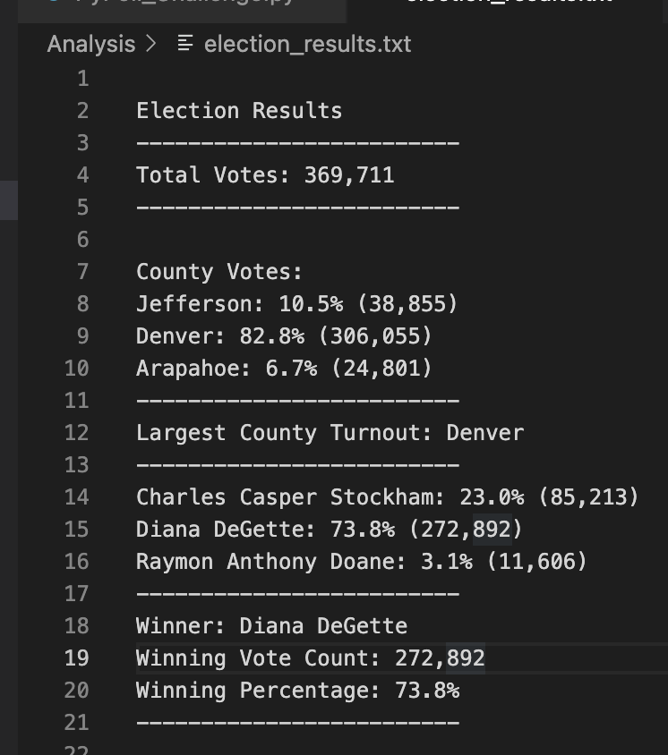
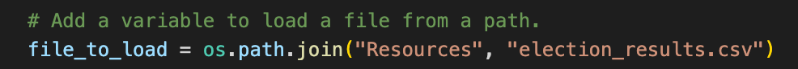
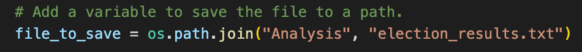

# Colorado District Election Analysis
## Overview of Election Audit
### Election Audit - Why in Python
This election audit was generated by Tom, a Colorado Board of Elections employee. This project was assigned by Tom's manager, Seth--he wants to automate the task in Python rather than continuing to run this in Excel. Tom is taking a look at this district's mailin-in ballots, punch cards, and DRE counting machine votes.
### What We Reviewed
For this audit, Tom created an overview of total number of votes, list of candidates that received votes, total number of votes each candidate recieved, percentage of votes each candidate won, the winner of the election based on popular vote.
## Election Audit Results
### This Election: A Bird's Eye View
- 369,711 votes cast in this congressional election
- Jefferson: 10.5% (38,855) ; Denver: 82.8% (306,055) ; Arapahoe: 6.7% (24,801)
- Denver had the largest number of votes
- Charles Casper Stockham: 23.0% (85,213) ; Diana DeGette: 73.8% (272,892) ; Raymon Anthony Doane: 3.1% (11,606)
- Winner -- Diana DeGette: 73.8% (272,892)

## Election Audit Summary
### A Business Proposal
This script is simple, versatile, and easy to use. For it to be utilized for other elections, it would need modifications in two places: what file is being read and what file the output is being written to. 

If we wanted to show more number summaries besides percentage and vote count by county and by candidate, we could add those as well (for example: by district if we are analyzing the votes of the entire state of Colorado). 
